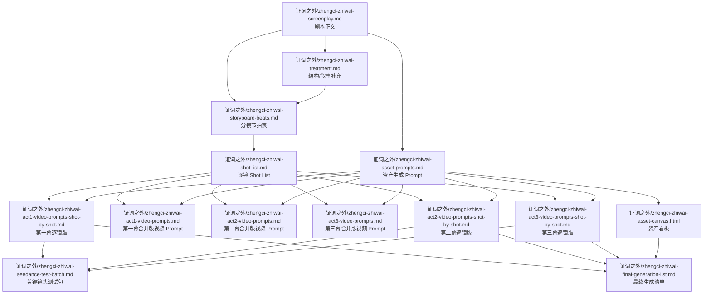
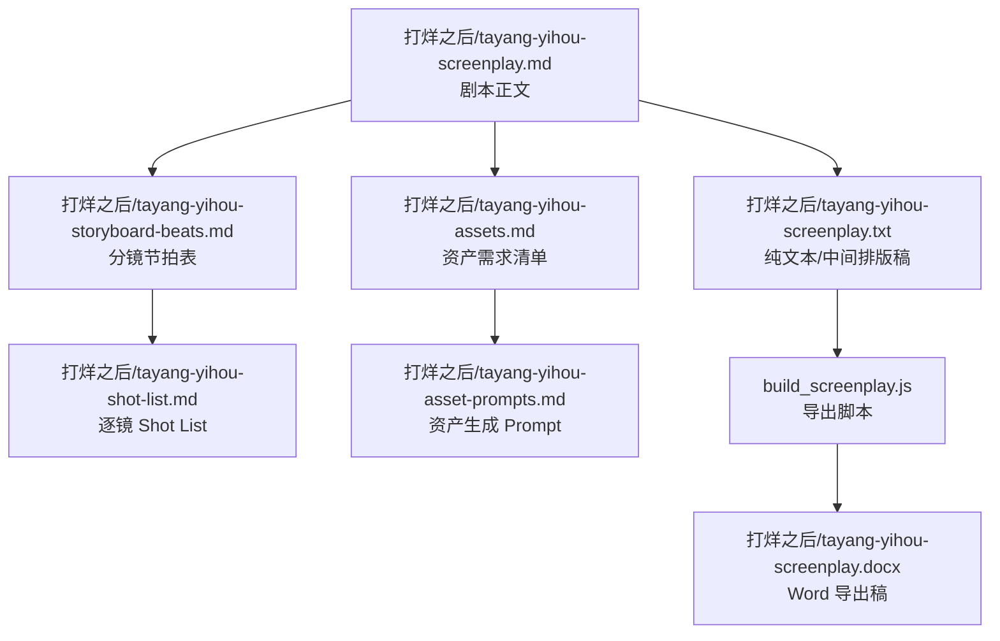

# screenplay 文件关系图

本文件用于说明 screenplay 目录下各文件的职责、上下游关系，以及实际工作时应该优先编辑哪些文件。

当前目录里有两套项目：

- 证词之外
- 打烊以后

阅读建议：

1. 先看“主文件 / 派生文件”判断该改哪里
2. 再看“文件生产流程图”理解上下游
3. 最后看“按工作目标查文件”快速定位

---

## 一、主文件与派生文件

### 1. 证词之外

| 文件 | 类型 | 作用 | 是否主文件 |
| --- | --- | --- | --- |
| `证词之外/zhengci-zhiwai-screenplay.md` | 剧本正文 | 核心剧情、场次、对白、动作 | 是 |
| `证词之外/zhengci-zhiwai-treatment.md` | 开发稿 / treatment | 补充叙事、结构、人物动机 | 是 |
| `证词之外/zhengci-zhiwai-storyboard-beats.md` | 节拍表 | 把剧情拆成导演/分镜节奏块 | 是 |
| `证词之外/zhengci-zhiwai-shot-list.md` | 逐镜表 | 镜号、景别、机位、时长、台词 | 是 |
| `证词之外/zhengci-zhiwai-asset-prompts.md` | 资产 prompt | 生成角色、场景、道具图参 | 是 |
| `证词之外/zhengci-zhiwai-asset-canvas.html` | 资产看板 | 查看资产是否齐全、是否已生成 | 否 |
| `证词之外/zhengci-zhiwai-act1-video-prompts.md` | 合并版视频 prompt | 按幕输出多镜头视频生成 prompt | 派生 |
| `证词之外/zhengci-zhiwai-act2-video-prompts.md` | 合并版视频 prompt | 按幕输出多镜头视频生成 prompt | 派生 |
| `证词之外/zhengci-zhiwai-act3-video-prompts.md` | 合并版视频 prompt | 按幕输出多镜头视频生成 prompt | 派生 |
| `证词之外/zhengci-zhiwai-act1-video-prompts-shot-by-shot.md` | 逐镜视频 prompt | 一镜一条，适合精控生成 | 派生 |
| `证词之外/zhengci-zhiwai-act2-video-prompts-shot-by-shot.md` | 逐镜视频 prompt | 一镜一条，适合精控生成 | 派生 |
| `证词之外/zhengci-zhiwai-act3-video-prompts-shot-by-shot.md` | 逐镜视频 prompt | 一镜一条，适合精控生成 | 派生 |
| `证词之外/zhengci-zhiwai-seedance-test-batch.md` | 测试清单 | 先测哪些关键镜头 | 派生 |
| `证词之外/zhengci-zhiwai-final-generation-list.md` | 生产清单 | 最终生成顺序、资产引用、优先级 | 派生 |

### 2. 打烊以后

| 文件 | 类型 | 作用 | 是否主文件 |
| --- | --- | --- | --- |
| `打烊之后/tayang-yihou-screenplay.md` | 剧本正文 | 核心剧情、场次、对白、动作 | 是 |
| `打烊之后/tayang-yihou-storyboard-beats.md` | 节拍表 | 按段落拆节奏和情绪功能 | 是 |
| `打烊之后/tayang-yihou-shot-list.md` | 逐镜表 | 逐镜执行规划 | 是 |
| `打烊之后/tayang-yihou-assets.md` | 资产需求清单 | 定义需要哪些角色、场景、道具 | 是 |
| `打烊之后/tayang-yihou-asset-prompts.md` | 资产 prompt | 真正用于生成资产的提示词 | 是 |
| `打烊之后/tayang-yihou-screenplay.txt` | 纯文本/排版中间稿 | 便于导出或格式转换 | 派生 |
| `build_screenplay.js` | 导出脚本 | 生成格式化 docx 剧本 | 工具文件 |
| `打烊之后/tayang-yihou-screenplay.docx` | Word 导出稿 | 最终交付或打印版本 | 派生 |

---

## 二、文件生产流程图

### 1. 证词之外

### 2. 打烊以后

---

## 三、按工作目标查文件

### 1. 想改剧情、对白、场次

优先改：

- `证词之外/zhengci-zhiwai-screenplay.md`
- `打烊之后/tayang-yihou-screenplay.md`

如果是“证词之外”的结构说明或人物动机，也可能要同步看：

- `证词之外/zhengci-zhiwai-treatment.md`

### 2. 想改镜头顺序、景别、机位、时长

优先改：

- `证词之外/zhengci-zhiwai-shot-list.md`
- `打烊之后/tayang-yihou-shot-list.md`

如果只是调整整体节奏和段落功能，先改：

- `证词之外/zhengci-zhiwai-storyboard-beats.md`
- `打烊之后/tayang-yihou-storyboard-beats.md`

### 3. 想改角色图、场景图、道具图的生成方式

优先改：

- `证词之外/zhengci-zhiwai-asset-prompts.md`
- `打烊之后/tayang-yihou-asset-prompts.md`

如果只是补一份资产需求说明或核对缺失，参考：

- `打烊之后/tayang-yihou-assets.md`
- `证词之外/zhengci-zhiwai-asset-canvas.html`

### 4. 想改视频生成 prompt

快速出段落，用合并版：

- `证词之外/zhengci-zhiwai-act1-video-prompts.md`
- `证词之外/zhengci-zhiwai-act2-video-prompts.md`
- `证词之外/zhengci-zhiwai-act3-video-prompts.md`

需要精确控制单镜头，用逐镜版：

- `证词之外/zhengci-zhiwai-act1-video-prompts-shot-by-shot.md`
- `证词之外/zhengci-zhiwai-act2-video-prompts-shot-by-shot.md`
- `证词之外/zhengci-zhiwai-act3-video-prompts-shot-by-shot.md`

### 5. 想直接执行生成

先测关键镜头：

- `证词之外/zhengci-zhiwai-seedance-test-batch.md`

整片按顺序生成：

- `证词之外/zhengci-zhiwai-final-generation-list.md`

---

## 四、实际工作建议

### 1. 证词之外

推荐工作顺序：

1. 先改 `证词之外/zhengci-zhiwai-screenplay.md`
2. 再同步 `证词之外/zhengci-zhiwai-storyboard-beats.md` 和 `证词之外/zhengci-zhiwai-shot-list.md`
3. 再改视频 prompt 文件
4. 最后更新测试批次和最终生成清单

### 2. 打烊以后

推荐工作顺序：

1. 先改 `打烊之后/tayang-yihou-screenplay.md`
2. 再改 `打烊之后/tayang-yihou-storyboard-beats.md` 和 `打烊之后/tayang-yihou-shot-list.md`
3. 再改 `打烊之后/tayang-yihou-assets.md` 和 `打烊之后/tayang-yihou-asset-prompts.md`
4. 最后用 `build_screenplay.js` 导出新的 `打烊之后/tayang-yihou-screenplay.docx`

---

## 五、一句话判断法

- 写故事，看 screenplay
- 看结构，看 treatment / storyboard beats
- 做分镜，看 shot list
- 生图参，看 asset prompts
- 跑视频，看 act video prompts
- 做测试，看 seedance test batch
- 做整片执行，看 final generation list
- 导出 Word，看 build_screenplay.js + docx
